EMPLOYEE ENGAGEMENT DASHBOARD — OVERVIEW

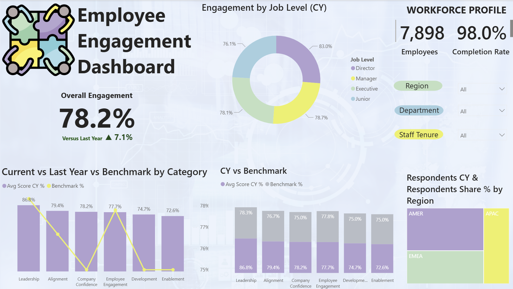

Built in Microsoft Power BI, this interactive dashboard presents a consolidated view of our annual Employee Engagement results. It combines Current Year (CY) and Last Year (LY) survey data with industry benchmarks to help leaders quickly understand performance, identify gaps, and prioritize actions.
What you’ll see
	• KPI cards: Overall Engagement, YoY change, and Completion Rate.
	• Comparisons: CY vs LY and Benchmark by category.
	• Segmentation: Engagement by Job Level and regional respondent mix.
	• Open-ended context: Dedicated visuals and files (themes, sentiment, length) for qualitative insight.
	• Respondent Profile: Slicers for Region, Department, and Staff Tenure.
How to use it
	• Apply the Region / Department / Staff Tenure slicers to focus the view on your audience.
	• Hover or click a bar/segment to cross-filter related visuals and view exact values.
	• Use the category and job-level charts to locate strengths and gaps; pair with open-ended themes for root causes.
This experience replaces static reporting with an interactive, governed view designed for decision-ready conversations and targeted action planning.

	EXECUTIVE SUMMARY
	Key KPIs
	Metric	Value
	Overall Engagement	78.2%
	Year-over-Year Change	+7.1 percentage points
	Completion Rate	98.0%
	Respondents (CY)	7,898
		
	This people analytics project explores key trends in employee engagement using a Power BI dashboard, focusing on categories, job levels, regions, departments, and staff tenure, with supporting analysis of open-ended feedback. Headline KPIs indicate Overall Engagement: _78.2%, **YoY change: **+7.1 pp, and **Completion Rate: **98%_, providing strong confidence in the insights. Visuals highlight that engagement follows an expected seniority gradient—Directors ≈ 83%, Managers ≈ 78.7%, Executives ≈ 78.1%, Juniors ≈ 76.1%—signaling opportunity in early-career enablement and coaching. Across categories, results cluster in the mid-70s vs. industry benchmark; areas nearer the lower bound (e.g., Enablement, Development) warrant targeted actions. Regional participation is well distributed across AMER, EMEA, APAC (AMER largest share), ensuring balanced representation. Taken together, the dashboard surfaces clear action points: close gaps to benchmark, focus on early-career support, and translate open-ended themes into concrete initiatives and manager playbooks.
	
	ABOUT THE COMPANY
	MosaicWorks, Inc. is a global digital products and services company operating across AMER, EMEA, and APAC. We design, build, and run cloud platforms and data solutions for enterprise clients in retail, healthcare, and financial services.
	Our people strategy emphasizes One Team, Customer First, Integrity, Curiosity, and Continuous Improvement, with consistent investment in learning, mobility, and manager effectiveness.
	
	PROBLEM STATEMENT
	Leaders needed a governed, interactive view of engagement results that:
		1. Consolidates survey data into a single, reliable model.
		2. Compares Current Year vs Last Year and Industry Benchmark consistently.
		3. Reveals differences by Region, Department, Job Level, and Staff Tenure, and brings open-ended feedback into the discussion.
	The prior process relied on spreadsheets and static decks, limiting exploration speed, consistency, and actionability.
	
	AIM OF THE PROJECT
		• Deliver an interactive Power BI dashboard surfacing the core KPIs (Overall Engagement, YoY change, Completion Rate) with clear drill-downs.
		• Provide comparison views (CY vs LY vs Benchmark) that stay interpretable while audience filters are applied.
		• Include segment views (Job Level, Region participation) and reference artifacts (ERD, category visuals, open-ended analysis) for decision-ready conversations.
		• Establish a repeatable model and theme so future survey waves can be refreshed with minimal effort and consistent quality.
	
	CHART & DEEP DIVE ANALYSIS
	
	Engagement by Job Level (CY)
	
	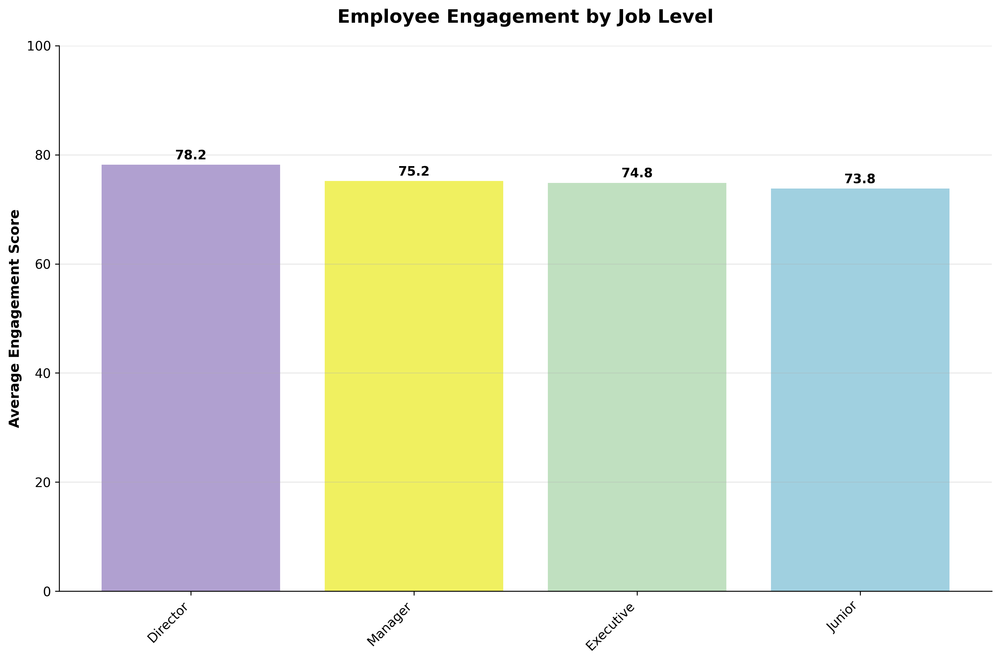
	
	Question it answers
	Which job levels report the highest and lowest engagement, and how large is the gap between levels?
	How to read it
	Each bar shows the average engagement score (0–100) for a job level in the current year. Labels at the top of bars display exact values.
	Key insights
		• Director: 78.2 — highest among all levels.
		• Manager: 75.2 and Executive: 74.8 — mid-tier, tightly clustered.
		• Junior: 73.8 — lowest engagement.
		• Spread: ~4.4 points from Director to Junior, indicating a consistent seniority gradient.
	Why it matters
	Lower engagement in early-career roles is a common driver of turnover risk and productivity drag. Addressing enablement, recognition, and career clarity at these levels can lift overall scores fastest.
	Recommended actions
		• Early-career enablement: strengthen onboarding, peer mentoring, and role clarity for Junior roles.
		• Manager coaching: focus on check-ins, feedback quality, and career discussions for Manager-led teams.
		• Recognition mechanisms: implement lightweight recognition programs across entry and mid levels.
		• Targeted pulse surveys: run short follow-ups for Junior/Executive cohorts to validate pain points before intervention.
	Caveats/assumptions
		• Results are averages; sample sizes by level should be reviewed before drawing conclusions.
		• Differences are descriptive (not causal). Consider department and region interaction effects when acting on these findings.
	
	
	Engagement Scores by Category (CY)
	
	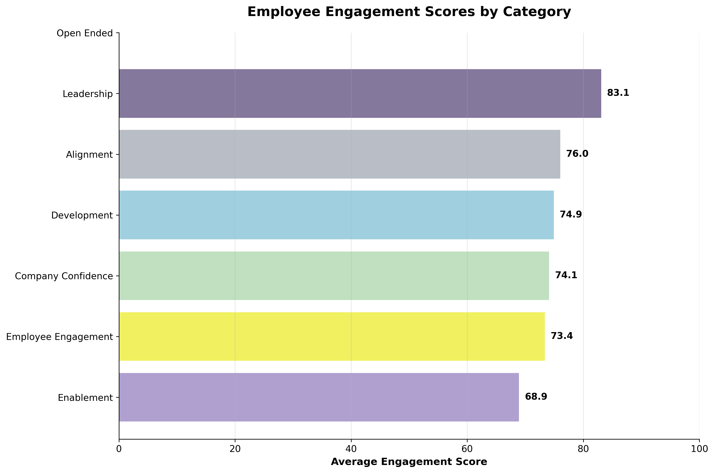
	
	Question it answers
	Which engagement categories score highest/lowest, and where should improvement efforts focus?
	How to read it
	Horizontal bars show the average engagement score (0–100) by category for the current year. Open Ended appears for context but is not scored; it represents qualitative feedback.
	Key insights
		• Leadership: 83.1 — strongest category; leadership practices are perceived positively.
		• Alignment: 76.0 — healthy but with room to strengthen strategic clarity and goal alignment.
		• Development: 74.9 and Company Confidence: 74.1 — mid-tier; focus on learning pathways and organizational trust.
		• Employee Engagement (overall sentiment): 73.4 — slightly below the mid-70s cluster.
		• Enablement: 68.9 — lowest; likely constraints include tools, processes, or workload friction.
	Why it matters
	Categories with lower scores often correlate with turnover risk and productivity drag. Improving Enablement typically yields rapid gains because it removes day-to-day blockers.
	Recommended actions
		• Enablement (priority): streamline workflows, reduce manual steps, and address tool gaps; run quick pulse checks post-changes.
		• Development: expand role-based learning paths and clarify promotion criteria; ensure managers schedule career conversations.
		• Alignment: reinforce OKRs/goals at team level; use manager toolkits for cascading strategy.
		• Leverage strengths: mine Leadership practices from high-scoring teams and replicate across departments.
	Caveats/assumptions
		• Scores are averages; validate with Region, Department, and Tenure filters for segment nuances.
		• Benchmark comparisons should use the same scale and question mapping; Open Ended is qualitative and excluded from scoring.
	
	
	
	Engagement by Region (CY)
	
	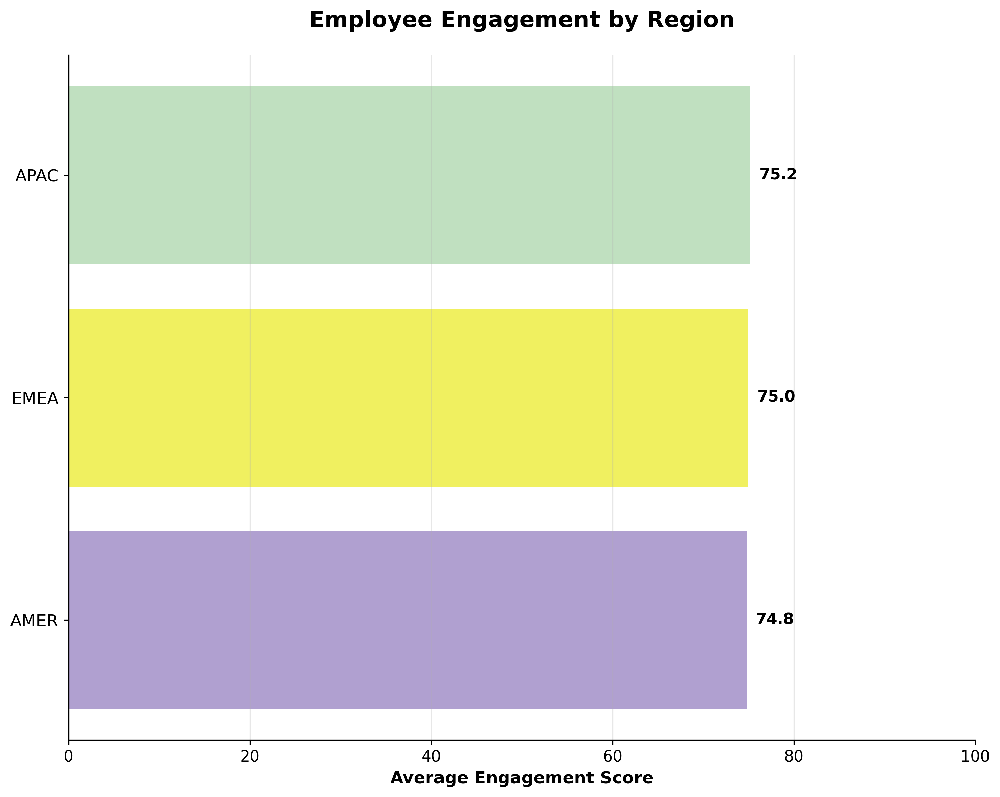
	
	Question it answers
	Which regions report higher or lower engagement, and how large are the differences?
	How to read it
	Bars show the average engagement score (0–100) for each region in the current year. Labels at the end of each bar display exact values.
	Key insights
		• APAC: 75.2 — highest regional average; marginally leads the global set.
		• EMEA: 75.0 — closely tracks APAC and sits at the global average.
		• AMER: 74.8 — slightly below APAC/EMEA but within 0.4 points of the top region.
		• Spread across regions is minimal (~0.4 points), indicating broadly consistent engagement worldwide.
	Why it matters
	Small regional gaps suggest global programs are landing consistently, but also mean local wins (manager practices, comms cadence, enablement fixes) can be replicated with high likelihood of success.
	Recommended actions
		• Capture and scale: document practices from APAC teams with above-average scores (manager rituals, recognition, tooling) and pilot in AMER and EMEA.
		• Segment within region: use the dashboard filters to examine Department and Tenure inside each region to surface pockets of risk masked by the small regional spread.
		• Localized enablement: verify language/time-zone support, tooling access, and process friction unique to each region; address quick-win blockers first.
		• Leader communication: align regional leadership on the same engagement playbook and cadence (check-ins, career conversations, recognition).
	Caveats/assumptions
		• Differences are descriptive, not causal; validate with department/tenure cuts before acting.
		• Ensure respondent counts by region are adequate and balanced; low sample sizes can inflate or mute differences.
		• Benchmark comparisons should use the same scale and period for each region.
	
	
	
	Engagement vs Tenure (CY)
	
	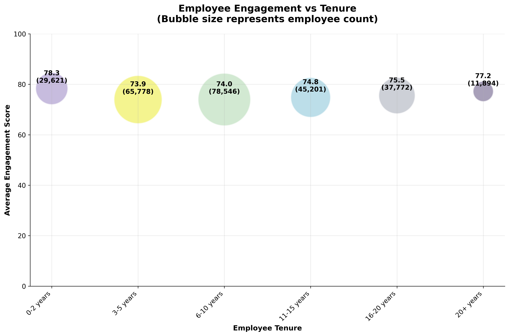
	
	Question it answers
	How does engagement vary across tenure bands, and where do the largest employee populations sit?
	How to read it
	Each bubble plots the average engagement score (0–100) for a tenure band on the Y-axis. The bubble size represents the employee count in that band. Labels show score and headcount.
	Key insights
		• 0–2 years: 78.3 (29,621 employees) — strongest engagement at entry.
		• 3–5 years: 73.9 (65,778) — lowest point; first dip after onboarding.
		• 6–10 years: 74.0 (78,546) — still muted and the largest population, amplifying impact.
		• 11–15 years: 74.8 (45,201) and 16–20 years: 75.5 (37,772) — gradual recovery.
		• 20+ years: 77.2 (11,894) — returns close to early-tenure levels.
		• Pattern suggests a U-shape: high at entry, dip at 3–10 years, then recovery with long tenure.
	Why it matters
	The 3–10 year window combines lower engagement with very large headcount, making it a disproportionate driver of overall results and potential attrition risk.
	Recommended actions
		• Career pathing & mobility: formalize promotion timelines and internal moves around 3–5 and 6–10 years.
		• Manager playbooks: ensure quarterly career/skills check-ins, recognition, and workload calibration for mid-tenure employees.
		• Targeted enablement: address process/tooling friction for the 6–10 cohort where impact is largest.
		• Pulse follow-ups: run short surveys for 3–10 years to validate drivers by department and region before interventions.
		• Learning programs: offer level-appropriate upskilling and mentorship to reduce stagnation.
	Caveats/assumptions
		• Scores are averages; differences are descriptive, not causal.
		• Tenure may correlate with job level and department; segment with filters to isolate effects.
		• Tenure represents time at company; if time in role differs materially, consider a separate cut.
	
	
	
	Employee Distribution by Department
	
	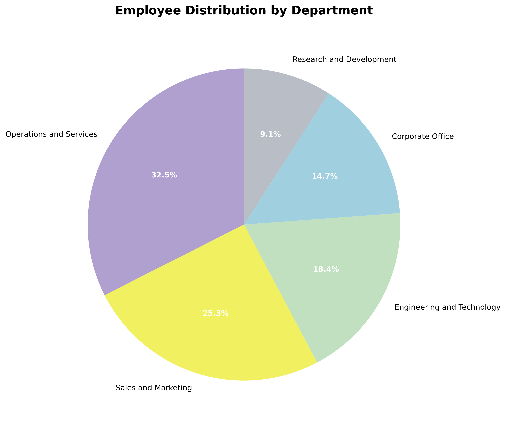
	
	Question it answers
	What is the workforce mix across departments, and which areas drive the largest share of employee voice?
	How to read it
	Each wedge shows the percentage of total headcount by department; labels display exact shares.
	Key insights
		• Operations & Services: 32.5% — largest group; frontline-heavy footprint.
		• Sales & Marketing: 25.3% — second largest; materially influences overall sentiment.
		• Engineering & Technology: 18.4% — under one-fifth of workforce.
		• Corporate Office: 14.7% — shared services and admin.
		• Research & Development: 9.1% — smallest cohort.
	Why it matters
	Departmental weighting shapes overall engagement. Improvements in Operations & Services and Sales & Marketing will have the greatest impact on company-wide KPIs; small cohorts (e.g., R&D) require careful interpretation due to variance.
	Recommended actions
		• Prioritize enablement and recognition programs in Operations & Services; reinforce manager practices where scale is largest.
		• Calibrate Sales & Marketing programs around coaching, targets, and recognition cadence.
		• For R&D/Corporate, set minimum-n rules and complement metrics with qualitative insight to avoid over-interpreting small samples.
		• Monitor response rates by department to ensure balanced voice and adjust outreach where needed.
	Caveats/assumptions
		• Chart shows headcount share, not engagement levels. Use department filters to evaluate scores and gaps.
		• Ensure response rates are proportionate; otherwise, participation bias may skew department-level conclusions.
	
	
	
	
	Open-Ended Response Volume by Question Type (CY)
	
	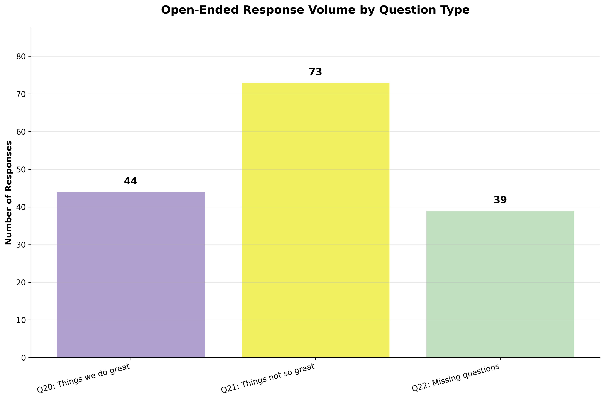
	
	Question it answers
	Where are employees choosing to write more open-ended feedback—what themes generate the most commentary?
	How to read it
	Each bar shows the count of written responses by open-ended question:
		• Q20: “Things we do great”
		• Q21: “Things not so great”
		• Q22: Additional comments / questions
	Key insights
		• Q21 (Things not so great): 73 — the highest volume, indicating strong energy around pain points and improvement ideas.
		• Q20 (Things we do great): 44 — a substantial set of positive signals to reinforce and scale.
		• Q22 (Additional comments): 39 — meaningful tail of clarifying questions or suggestions that may not map to a single category.
	Why it matters
	Open-ended volume is a proxy for issue salience. The higher volume on Q21 suggests employees are actively surfacing blockers; converting these into themes and actions can lift engagement faster than generic initiatives.
	Recommended actions
		• Theme extraction: cluster Q21 responses into 5–7 actionable themes (e.g., tooling, workload, communication, recognition).
		• Owner + SLA: assign each theme to an accountable leader with a target date and progress metric; publish a simple action tracker.
		• Scale the wins: review Q20 for high-impact practices and codify them (manager rituals, process tweaks, recognition programs).
		• Close the loop: communicate which themes are being addressed and what has changed; re-pulse those audiences after changes.
		• Segment where needed: break volumes by Department and Tenure to find hotspots masked at the aggregate level.
	Caveats/assumptions
		• Volume alone does not equal severity; pair with sentiment and theme frequency.
		• Ensure de-duplication and apply a minimum-n rule before publishing segment-level quotes.
		• Consider response length and vocabulary differences across departments/regions to avoid bias in automated text analysis.
	
	
	
	Open-Ended Themes (Q20 Strengths vs Q21 Improvements)
	
	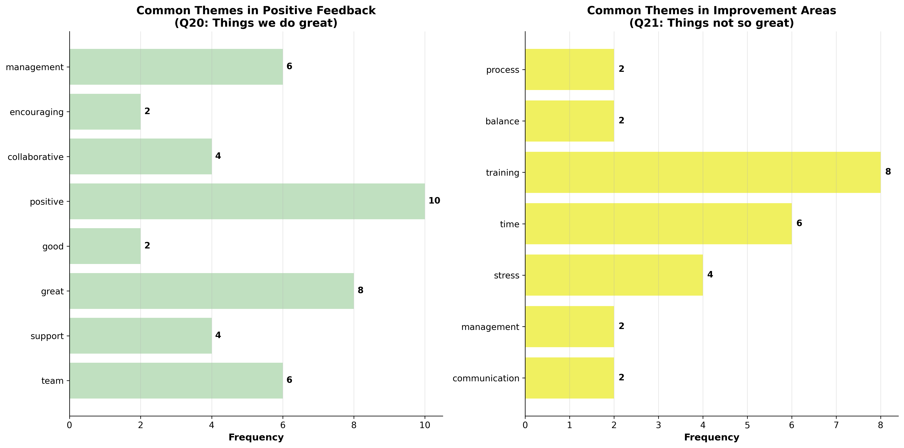
	
	Question it answers
	What do employees praise most and where do they see the biggest opportunities for improvement?
	How to read it
	The left panel summarizes positive themes from Q20 (Things we do great); the right panel summarizes improvement themes from Q21 (Things not so great). Bar length indicates theme frequency in comments.
	Key insights
		• Strengths (Q20)
			○ Positive (10) and Great (8) point to broadly favorable sentiment.
			○ Team (6), Management (6), Support (4), and Collaborative (4) highlight strong teamwork and perceived manager backing.
		• Improvements (Q21)
			○ Training (8) is the top request—employees want clearer learning paths or role onboarding.
			○ Time (6) and Stress (4) indicate workload/priority pressure.
			○ Communication (2), Management (2), Process (2), and Balance (2) appear as smaller but recurring friction points.
	Why it matters
	Open-ended themes convert qualitative feedback into actionable categories. Addressing the largest and most consistent issues (training and time pressure) typically yields faster engagement gains than broad, unfocused initiatives.
	Recommended actions
		• Training (priority): stand up role-based curricula; clarify certification/promotion linkages; track participation and completion.
		• Workload & time management: tighten prioritization, reduce low-value tasks, and set team-level WIP limits; align sprint/OKR planning to capacity.
		• Stress & balance: reinforce PTO norms, meeting hygiene, and after-hours expectations; enable flexible options where feasible.
		• Communication & process: ship a concise manager toolkit (1-pager) covering weekly rituals, change communications, and escalation paths; simplify top pain-point processes.
		• Scale strengths: document and replicate high-performing team/management practices (recognition cadence, feedback quality, stand-ups).
	Caveats/assumptions
		• Frequencies indicate how often a theme was mentioned, not severity. Pair with sentiment or up-/down-votes where available.
		• Theme classification may merge similar words; minor labeling noise is expected.
		• Validate themes by department and tenure to locate hotspots before executing targeted actions.
		• Quotes are anonymized; apply minimum-n thresholds before publishing examples.
	
	
	
	Open-Ended Response Rate by Department (CY)
	
	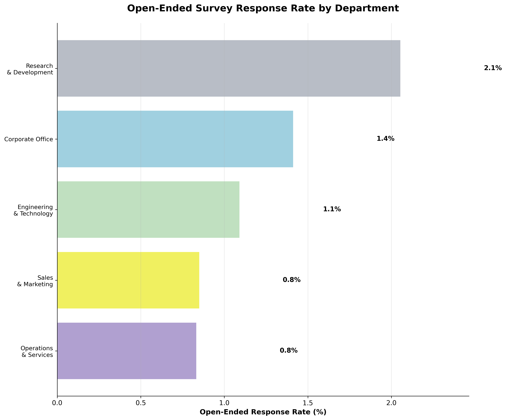
	
	Question it answers
	Which departments are most likely to leave written feedback, and where might we need to encourage more voice?
	How to read it
	Bars show the open-ended response rate (%) within each department (share of respondents who wrote a comment). Labels to the right display exact rates.
	Key insights
		• Research & Development: 2.1% — highest open-ended participation; strong qualitative voice.
		• Corporate Office: 1.4% — above mid-pack; admin/shared services contribute meaningfully.
		• Engineering & Technology: 1.1% — moderate commentary volume.
		• Sales & Marketing: 0.8% and Operations & Services: 0.8% — lowest rates; frontline and quota-driven roles may face time constraints.
	Why it matters
	Open-ended rates indicate voice richness. Departments with lower rates risk missing context behind their scores, making action planning less precise.
	Recommended actions
		• Improve prompts for low-rate groups: add one-click topic tags plus optional text to reduce effort.
		• Manager nudges: request 1–2 concrete examples during team huddles following the survey to convert verbal input into written comments.
		• Targeted reminders aligned to workload cycles (avoid end-of-quarter for Sales; avoid shift changes for Operations).
		• Show impact: publish short “You said, we did” updates so teams see the value of writing comments.
		• Normalize by headcount and track wave-over-wave to ensure changes are real, not sampling noise.
	Caveats/assumptions
		• A higher comment rate does not imply worse conditions; it can reflect engagement with the process. Pair with sentiment and themes.
		• Small departments will show more volatility; apply minimum-n thresholds before drawing conclusions.
	
	
	
	
	Open-Ended Sentiment by Job Level (CY)
	
	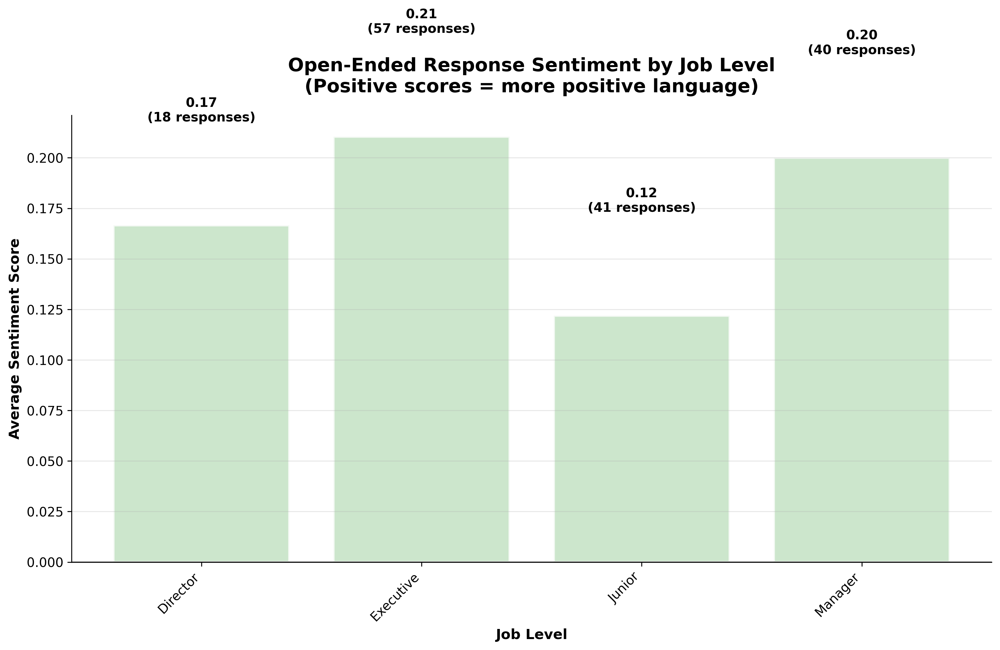
	
	Question it answers
	How does the tone of written comments vary by job level, and which levels use more positive or negative language?
	How to read it
	Bars show the average sentiment score for each level (higher = more positive language). Values above each bar show the score and number of comments used to compute it.
	Key insights
		• Executive (0.21, n=57) and Manager (0.20, n=40) exhibit the most positive comment tone.
		• Director (0.17, n=18) is moderately positive, with a small sample.
		• Junior (0.12, n=41) is the least positive, aligning with lower engagement at earlier career stages.
		• Response counts are uneven; Executives provide the largest set among leadership tiers, improving reliability there.
	Why it matters
	Sentiment complements scores by revealing the emotional valence of feedback. Lower positivity among Junior employees can signal friction around enablement, workload, or growth clarity—drivers that may not be fully captured by closed-ended items.
	Recommended actions
		• Junior focus: pair sentiment with Q21 themes to identify top pain points (e.g., training, time pressure). Launch targeted fixes and re-pulse the cohort.
		• Manager enablement: use positive language patterns from Executive/Manager comments to craft manager toolkits (recognition rituals, career conversations, comms cadence).
		• Close-loop comms: highlight “You said, we did” outcomes to uplift sentiment in cohorts with lower positivity.
		• Monitor trend: track sentiment by level each wave; flag movements >0.05 as meaningful, given current sample sizes.
	Caveats/assumptions
		• Sentiment is descriptive and model-dependent; sarcasm, slang, or multilingual comments may reduce accuracy.
		• Small n (e.g., Director) increases volatility; apply minimum-n thresholds before publishing quotes.
		• Use in combination with themes and quantitative scores to avoid over-interpreting tone alone.
	
	
	
	
	Open-Ended Response Length Analysis (CY)
	
	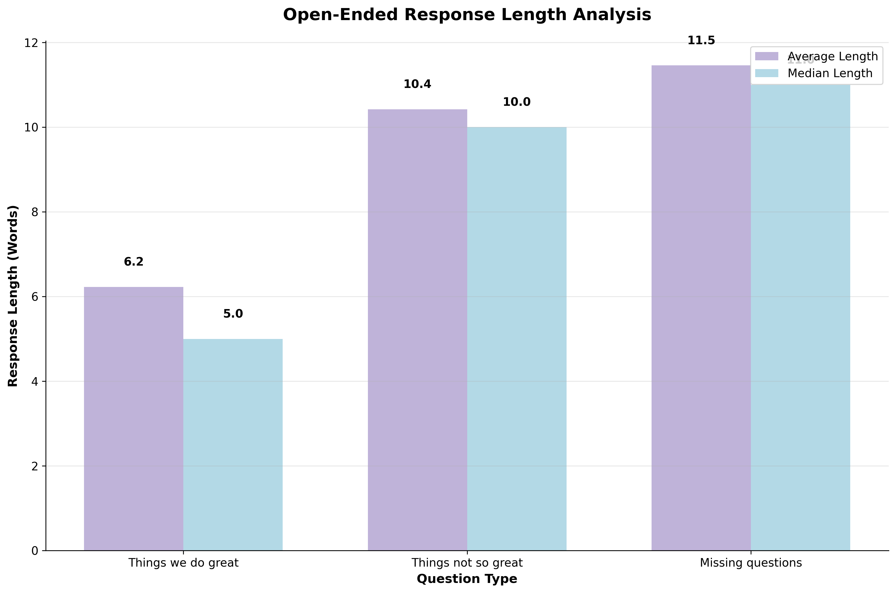
	
	Question it answers
	How detailed are employees’ written comments across question types, and where should text-analytics effort be focused?
	How to read it
	For each open-ended question type, the chart shows the Average and Median number of words per response. Larger values indicate longer, more detailed comments.
	Key insights
		• Missing questions / additional comments: Avg 11.5, Median 11.0 — the longest responses; employees use this space to elaborate or raise specific issues.
		• Things not so great: Avg 10.4, Median 10.0 — also long and detailed, indicating substantial context behind pain points.
		• Things we do great: Avg 6.2, Median 5.0 — shorter notes; positive feedback tends to be concise.
		• Avg vs Median gaps are small, suggesting limited influence from extremely long outliers and relatively consistent response lengths within each question type.
	Why it matters
	Longer responses typically carry richer, actionable detail. Prioritizing text mining effort on Q21 and Q22 will yield more specific themes and root causes than positive shout-outs alone.
	Recommended actions
		• Prioritize coding for Q21 & Q22: allocate more analyst/model time to these items; expect deeper, more nuanced themes.
		• Guided prompts for Q20: add optional sub-prompts (“What practice should we scale?”) to capture more actionable positives.
		• Theme playbooks: convert long-form Q21/Q22 themes into clear owner/action/SLA items; publish a concise “You said, we did.”
		• Segment checks: examine response length by Department and Tenure to spot cohorts providing unusually terse or verbose feedback (possible workload or tooling constraints).
		• Model calibration: use length thresholds to tune topic modeling and sentiment weighting (e.g., give slightly more weight to longer, specific comments).
	Caveats/assumptions
		• Length ≠ severity; some concise comments are highly actionable. Combine with sentiment and theme frequency.
		• Mobile responders and non-native speakers often produce shorter text; avoid penalizing cohorts for brevity.
		• Ensure deduplication and minimum-n thresholds before publishing segment-level examples.
	
	
	
	
	Q20 Detailed Word Analysis — Positive Feedback (Things we do great)
	
	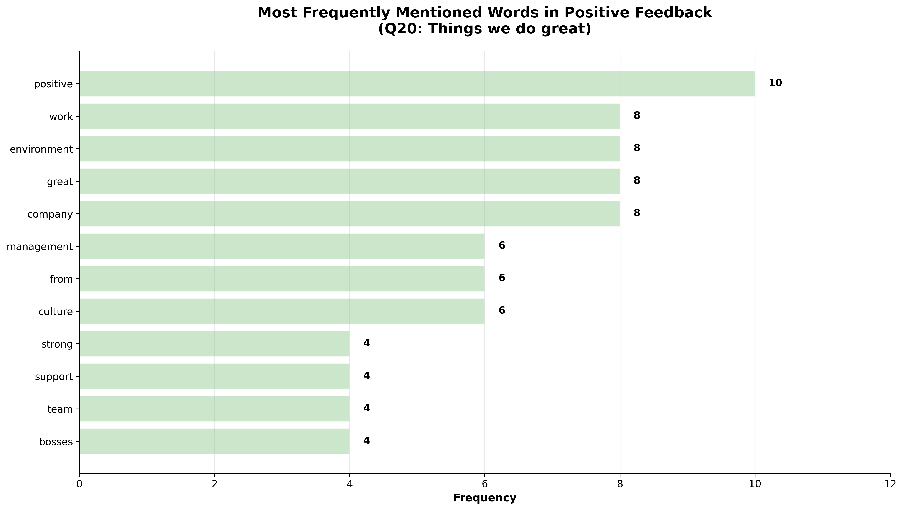
	
	Question it answers
	What specific words dominate positive open-ended comments and what strengths should we reinforce?
	How to read it
	Bars show the frequency of terms extracted from Q20 comments after basic cleaning. Higher counts indicate words that appear more often in positive feedback.
	Key insights
		• Strongest signals: positive (10), work (8), environment (8), great (8), company (8) — employees frequently praise the work environment and overall company experience.
		• Reinforcing themes: management (6), culture (6), team (4), support (4) — points to valued manager behavior, team dynamics, and support structures.
		• Minor noise remains (e.g., connector word “from”); further stop-word tuning can tighten the signal.
	Why it matters
	Positive themes identify practices worth scaling and stories worth telling. Reinforcing what already works sustains momentum while improvement actions are underway.
	Recommended actions
		• Codify strengths: document examples of effective work environment practices and team/manager support; replicate across departments.
		• Recognition cadence: formalize lightweight peer/manager recognition to celebrate great work and positive culture.
		• Hiring/employer brand: feature these strengths (environment, culture, team) in recruiting materials and onboarding.
		• Close the loop: connect strengths to outcomes (retention, productivity) to keep leaders invested.
	Caveats/assumptions
		• Word counts are descriptive; some terms (e.g., from) are non-informative and should be filtered with improved stop-word lists and lemmatization.
		• Interpret alongside themes and sentiment for context; individual word frequency does not convey nuance or causality.
	
	
	
	
	Q21 Detailed Word Analysis — Improvement Areas (Things not so great)
	
	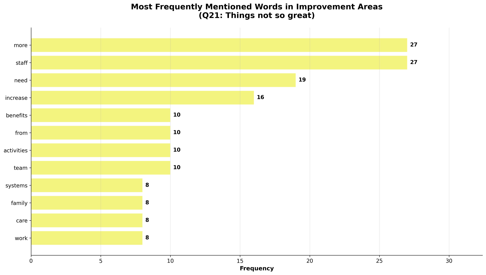
	
	Question it answers
	Which words dominate employees’ improvement comments and what issues do they point to?
	How to read it
	Bars show the frequency of single words extracted from Q21 responses after basic cleaning. Higher counts indicate words that appear more often in “not so great” feedback.
	Key insights
		• The most common terms are more (27) and staff (27) → together they strongly suggest a call for more staffing/capacity.
		• need (19) and increase (16) reinforce demand-oriented language (e.g., “need more,” “increase resources/headcount/budget”).
		• Secondary themes: benefits (10), activities (10), team (10), systems (8), work (8), family (8), care (8). These point to total rewards, engagement programming, collaboration, tool/process friction, and work–life considerations.
		• The token from (10) is a connector word that slipped past the stop-word list; it has little interpretive value.
	Why it matters
	The vocabulary concentrates around capacity and resources, indicating that workload or staffing ratios are perceived as the primary friction. Addressing these tends to lift engagement, reduce stress, and improve delivery quality.
	Recommended actions
		• Capacity planning: review staffing ratios, queue backlogs, and overtime to validate the “more staff” signal; prioritize critical teams first.
		• Workload management: streamline processes and remove low-value tasks; invest in automation where feasible (systems, work).
		• Total rewards check: assess benefits competitiveness and communication clarity; target quick wins with high perceived value.
		• Engagement programming: organize team activities and recognition to support collaboration and morale.
		• Well-being & flexibility: address family/care constraints via scheduling flexibility, PTO norms, and manager guidance.
		• Close the loop: publish “You said, we did” updates that explicitly respond to the need/increase/more staff theme.
	Caveats/assumptions
		• Counts reflect single words; phrases like “more staff” or “increase benefits” are inferred. Use bi-grams/tri-grams to confirm.
		• Frequency ≠ severity; pair with sentiment and theme clustering for prioritization.
		• Improve the stop-word list (e.g., remove from) and lemmatize (e.g., “needs/needed” → need) for cleaner signals.

	
	ASSUMPTIONS & LIMITATION
	Data scope
		• Results reflect the current survey wave (CY) with comparisons to LY where Tag is available; no inference beyond these periods.
		• Records are anonymized (Masked ID) and joined to demographics by Masked ID + SurveyYear; any mismatch or duplicate keys are excluded.
	Survey design
		• Participation is voluntary; despite a 98% completion rate, non-response bias may still exist in specific sub-populations.
		• Questions are treated as equal weight unless explicitly benchmarked; no psychometric weighting or factor analysis has been applied.
	Modeling & measures
		• Avg Score % is the mean of item scores scaled to 0–100; means are sensitive to outliers and item distributions.
		• Tenure bands are derived (DAX) and may not equal “time in role”; interpretations assume time at company.
		• Relationships are descriptive, not causal; segment differences may be confounded by department, region, or level mixes.
	Benchmarks
		• Industry Benchmark values are assumed to be comparable in question wording, scale, and timing; small misalignments can inflate/deflate gaps.
		• Benchmark lines represent point estimates without confidence intervals.
	Open-ended analytics
		• Text themes and sentiment are produced with light NLP; accuracy can be reduced by sarcasm, slang, multilingual text, or short replies.
		• Word-frequency charts include residual stop-word noise; results should be paired with theme clustering for context.
		• Published examples follow a minimum-n rule to protect anonymity; small cohorts may be suppressed.
	Visualization & dashboard behavior
		• Filters apply post-aggregation logic appropriate to Power BI; slicer combinations with very small n may show unstable values.
		• Some visuals display rounded percentages; totals may not equal 100% due to rounding.
		• Right-axis scales are disabled unless explicitly required; all % values are intended to share the left axis (0–100%).
	Operational considerations
		• Dataset is a point-in-time extract; changes to org structure after the survey are not reflected.
		• Refresh is manual for this project demo; production use should implement scheduled refresh and source controls.
	Interpretation guidelines
		• Treat gaps < 1.0 pp as noise unless sample sizes are large and stable; prioritize practical, sustained differences.
		• Use triangulation: combine scores, benchmarks, open-ended themes, and segment cuts before committing actions.
		• All insights are intended for internal decision-making and should be validated with HRBPs and line leaders prior to rollout.
	
	
	
	FUTURE OPPORTUNITIES
	• Deeper driver analysis
		○ Add Key Influencers and Decomposition Tree pages to quantify which factors most increase engagement.
		○ Build variance-to-benchmark and confidence intervals for categories with sufficient n.
	• Longitudinal insights
		○ Create a wave-over-wave fact table for multi-year trendlines, cohort tracking, and seasonality checks.
		○ Introduce retention linkage (join engagement to attrition and internal mobility outcomes) with privacy guards.
	• Advanced text analytics
		○ Move from word counts to topic modeling (bi/tri-grams, LDA/BERTopic) and aspect-based sentiment.
		○ Add theme trend charts and a quote browser with minimum-n suppression.
	• Operational action tracking
		○ Embed a lightweight action register (owner, SLA, status) and show progress on the dashboard (“You said, we did”).
		○ Scorecard department action completion vs. impact on subsequent waves.
	• Audience and access
		○ Implement row-level security (RLS) for leader views; add bookmark presets for common segments.
		○ Provide exportable briefings (auto-generated PPT/PDF) by region/department.
	• Data quality & governance
		○ Automate scheduled refresh and data validation (key integrity, duplicate checks, outlier alerts).
		○ Standardize question/benchmark mapping with a governed lookup to avoid drift between waves.
	• Design & usability
		○ Add mobile-optimized pages and accessibility improvements (alt text, keyboard flow, high-contrast variants).
		○ Introduce comparative heatmaps for Category × Department and Level × Region to surface hotspots quickly.
	• Experiments & measurement
		• Pilot targeted interventions (enablement fixes, training programs) and track pre/post deltas using matched cohorts.
		• Build a simple forecast of next-wave engagement at the category level to set realistic targets.

RECOMMENDATIONS
	• Prioritize Enablement (highest lift)
		○ Remove day-to-day blockers (tools, access, process friction); automate repetitive steps.
		○ Set a near-term target of +3–4 pp in Enablement; assign an owner + SLA per fix and track to completion.
	• Target mid-tenure cohorts (3–10 years)
		○ Formalize career pathways, promotion timing, and internal mobility for 3–5 and 6–10 year bands.
		○ Add quarterly career/skills check-ins and mentorship for these groups.
	• Training & onboarding
		○ Launch role-based curricula tied to certification and promotion readiness.
		○ Close top gaps from Q21 (e.g., training and time themes) and measure completion rates.
	• Workload & capacity
		○ Validate “more staff/need/increase” signals with queue, overtime, and backlog data.
		○ Implement work-in-process limits and sharper prioritization; reduce low-value tasks.
	• Manager effectiveness
		○ Ship a manager toolkit (recognition cadence, one-on-ones, career conversations, communication norms).
		○ Coach managers of lower-scoring segments (especially Junior teams).
	• Scale what works
		○ Document practices from Leadership (high-scoring) and APAC (top regional average) and replicate across regions/departments.
	• Department focus
		○ Start with Operations & Services and Sales & Marketing (largest headcount share) to maximize company-wide impact.
		○ Use department heatmaps to identify local hotspots and sequence actions.
	• Strengthen employee voice
		○ Increase open-ended participation in Sales and Operations with lighter prompts and timed reminders.
		○ Convert Q21/Q22 themes into an action register (owner, due date, status) and publish “You said, we did.”
	• Measurement & follow-up
		○ Run targeted pulse surveys 6–8 weeks after interventions in affected cohorts.
		○ Track YoY and variance-to-benchmark by category and segment; flag movements ≥1.0 pp as meaningful.
	• Governance
		• Maintain a single, governed data model; standardize question/benchmark mapping.
		• Establish RLS leader views and a regular refresh cadence for ongoing visibility.

	
	 FILES INCLUDED
		• Dataset: 02_KS_EngagementSurvey_Dataset_Final.xlsx
		• Dashboard snapshot: dashboardsnapshotEE.png
		• Visual exports:
			○ department_distribution.png
			○ engagement_by_category.png
			○ engagement_by_job_level.png
			○ engagement_by_region.png
			○ engagement_vs_tenure.png
			○ openended_response_rate_by_dept.png
			○ openended_response_volume.png
			○ openended_themes_analysis.png
			○ q20_detailed_word_analysis.png
			○ q21_detailed_word_analysis.png
			○ response_length_analysis.png
			○ sentiment_by_job_level.png
		• Model diagram (ERD): ERD_EE.png
	
	
	
	ABOUT THE DATA (ERD)
	
	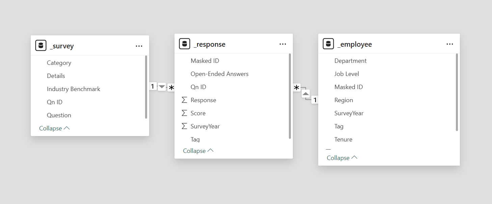
	
	Model summary (star schema)
		• Fact: _response – one row per respondent × question × survey year.
		• Dimensions:
			○ _employee – demographics by Masked ID (Region, Department, Job Level, Tenure…).
			○ _survey – question metadata (Category, Question text, Industry Benchmark).
	Relationships (cardinality & keys)
		• _response (Many) → _employee (One) on Masked ID + SurveyYear (composite key; single-direction filter from _employee to _response).
		• _response (Many) → _survey (One) on Qn ID (single-direction filter from _survey to _response).
	Table dictionary
		• _response (fact)
			○ Masked ID – anonymous employee identifier
			○ Qn ID – survey question ID
			○ Score – numeric item score (0–100 scale)
			○ Response – closed-ended response (where applicable)
			○ Open-Ended Answers – free text
			○ SurveyYear – e.g., 2023/2024
			○ Tag – “Current Year”, “Last Year” (used for CY/LY filters)
		• _employee (dimension)
			○ Masked ID – employee key
			○ Region, Department, Job Level
			○ Tenure – numeric years; derived: Tenure Band (e.g., <1, 1–2, 3–4, 5–9, 10+)
			○ SurveyYear, Tag
		• _survey (dimension)
			○ Qn ID – question key
			○ Category – Leadership, Alignment, Enablement, etc.
			○ Question / Details – text
			○ Industry Benchmark – reference % (0–100 scale)
	Grain & filter behavior
		• Grain: respondent × question × year.
		• Filters flow from dimensions to fact, keeping slicers (Region/Department/Tenure/Category/Year) consistent.
		• Use composite key (Masked ID + SurveyYear) to prevent year cross-joins.
	Calculated columns & key measures (examples)
		• Calculated column: Tenure Band (banding rules) with sort column.
		• Measures:
			○ Avg Score % = AVERAGE('_response'[Score]) / 100
			○ Avg Score CY % / Avg Score LY % via Tag filter
			○ YoY Δ (pp) = CY – LY
			○ Benchmark % = AVERAGE('_survey'[Industry Benchmark]) / 100
			○ Employees CY = DISTINCTCOUNT('_employee'[Masked ID]) (Tag = CY)
			○ Respondents CY = DISTINCTCOUNT('_response'[Masked ID]) (Tag = CY)
			○ Completion Rate CY % = Respondents CY / Employees CY
	Data assumptions
		• Scores and benchmarks are on the same 0–100 scale and question mapping.
		• Open-ended analytics are descriptive (light NLP); apply minimum-n rules for privacy.
		• Small segment results may be unstable; validate with respondent counts.
	
	
	DISCLAIMER
	This project is for portfolio and educational display only.
	No content may be copied, reproduced, or reused without permission.
	
	
	
	CONNECT WITH ME
		• LinkedIn: linkedin.com/in/desireesalvant
		• GitHub: github.com/DesireeSalvant
		• Portfolio: desireesalvant.com
		• Tableau Public: https://public.tableau.com/app/profile/desiree.salvant/vizzes
